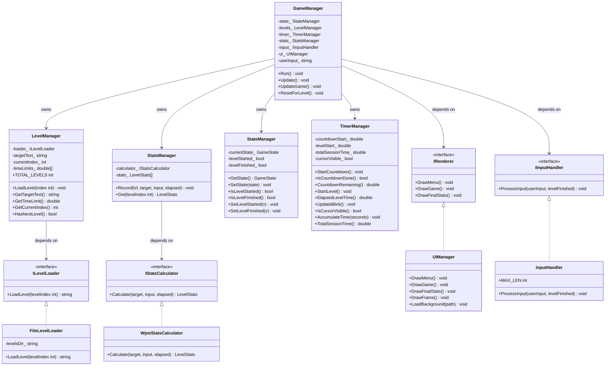
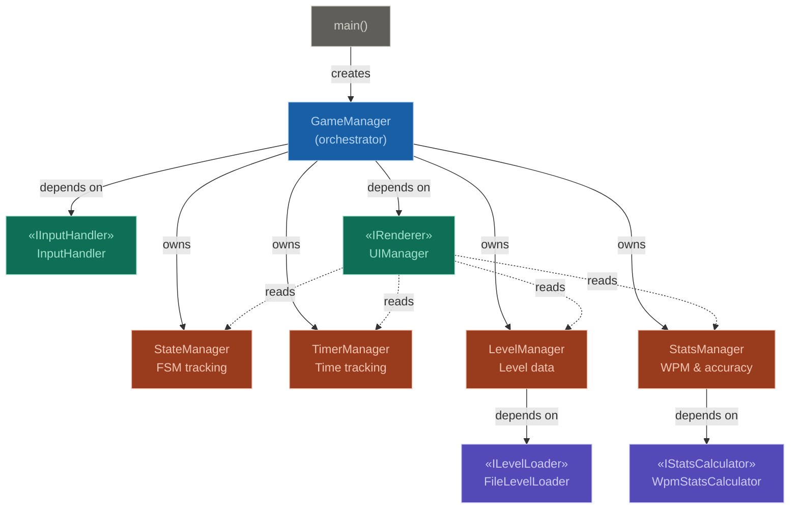
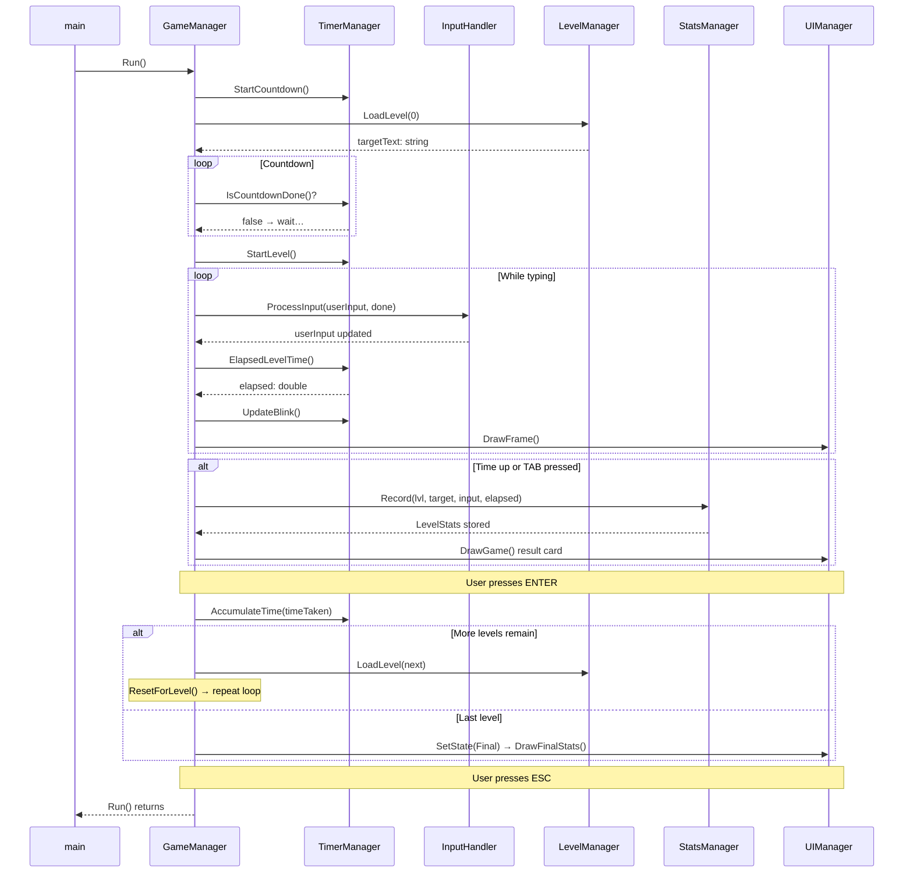

# 🎹 Typing Master— SOLID Refactor

> A Raylib-based typing speed game refactored from a monolithic OOP design into a fully SOLID-compliant multi-class C++17 architecture.

---

## 📋 Table of Contents

- [Project Overview](#-project-overview)
- [Folder Structure](#-folder-structure)
- [SOLID Principles Applied](#-solid-principles-applied)
- [UML Diagrams](#-uml-diagrams)
- [Class Responsibilities](#-class-responsibilities)
- [Full Class Reference](#-full-class-reference)
- [Dependencies](#-dependencies)
- [Build Instructions](#-build-instructions)
- [Git Workflow](#-git-workflow)
- [Commit History Guide](#-commit-history-guide)
- [AI Tools & Prompts Used](#-ai-tools--prompts-used)
- [Level Files](#-level-files)
- [Controls](#-controls)

---

## 🎮 Project Overview

**Typing Master** is a 3-level typing speed game built with [Raylib](https://www.raylib.com/). Players type displayed text as accurately and quickly as possible before the timer runs out. After all 3 levels, a final statistics screen shows WPM and accuracy per level.

### What Changed in the Refactor?

| Aspect | Original (`main` branch) | Refactored (`solid-refactor` branch) |
|---|---|---|
| Files | 1 `.cpp` file | 10 `.h` + 10 `.cpp` files |
| Classes | 1 monolithic `TypingGame` | 7 focused classes + 4 interfaces |
| Testability | Hard to unit test | Each class testable in isolation |
| Extensibility | Requires modifying existing code | New features via new classes |
| Dependencies | All concrete | Abstractions via interfaces |

---

## 📁 Folder Structure

```
TypingMasterPro/
│
├── main_original.cpp          ← Original monolithic code (main branch)
│
├── src/                       ← All .cpp implementation files
│   ├── main.cpp
│   ├── GameManager.cpp
│   ├── UIRenderer.cpp
│   ├── InputHandler.cpp
│   ├── LevelLoader.cpp
│   ├── Timer.cpp
│   ├── Stats.cpp
│
├── headers/                   ← All .h header files
│   ├── GameManager.hpp
│   ├── Istate.hpp
│   ├── StatsManager.hpp
│   ├── UIRenderer.hpp
│   ├── Common.hpp
│
├── assets/
│   └── bg.jpg                 ← Background image (add your own)
│
└── README.md
```

---

## 🧱 SOLID Principles Applied

### S — Single Responsibility Principle (SRP)

> *"A class should have only one reason to change."*

Each class owns exactly one concern:

| Class | Single Responsibility |
|---|---|
| `GameManager` | Orchestrate the game loop only |
| `UIManager` | All drawing / rendering only |
| `InputHandler` | Keyboard polling and input mutation only |
| `StateManager` | FSM state tracking only |
| `LevelManager` | Level data management only |
| `TimerManager` | All time-tracking concerns only |
| `StatsManager` | Storing per-level statistics only |
| `FileLevelLoader` | Loading level text from disk only |
| `WpmStatsCalculator` | WPM + accuracy calculation only |

### O — Open/Closed Principle (OCP)

> *"Open for extension, closed for modification."*

New loaders or calculators are added as new classes implementing `ILevelLoader` or `IStatsCalculator` — no existing code is touched.

### L — Liskov Substitution Principle (LSP)

> *"Subtypes must be substitutable for their base types."*

Every concrete class fully satisfies its interface contract — `FileLevelLoader`, `InputHandler`, and `UIManager` never leave a pure virtual unimplemented and never throw where the interface promises a return value.

### I — Interface Segregation Principle (ISP)

> *"Clients should not depend on interfaces they don't use."*

Four lean interfaces: `IRenderer`, `IInputHandler`, `ILevelLoader`, `IStatsCalculator` — each with exactly one method or concern.

### D — Dependency Inversion Principle (DIP)

> *"High-level modules depend on abstractions, not concretions."*

`GameManager` holds `shared_ptr` to interfaces. Concrete types are wired once in the constructor. `main()` only ever touches `GameManager`.

---

## 📐 UML Diagrams

### Class Diagram



---

### Component / Dependency Diagram



---

### Sequence Diagram — One Level Lifecycle



---

## 🗂 Class Responsibilities

```
main()
  └── GameManager              [orchestrator — game loop only]
        ├── StateManager       [FSM: Menu / Game / Final]
        ├── LevelManager       [which level, its text, time limit]
        │     └── ILevelLoader ←── FileLevelLoader
        ├── TimerManager       [countdown, elapsed, blink, session total]
        ├── StatsManager       [store per-level WPM / accuracy]
        │     └── IStatsCalculator ←── WpmStatsCalculator
        ├── IInputHandler      ←── InputHandler
        └── UIManager          [all drawing — implements IRenderer]
```

---

## 📖 Full Class Reference

### `StateManager`

```cpp
enum class GameState { Menu, Game, Final };

class StateManager {
public:
    GameState GetState()                const;
    void      SetState(GameState state);
    bool      IsLevelStarted()          const;
    bool      IsLevelFinished()         const;
    void      SetLevelStarted(bool v);
    void      SetLevelFinished(bool v);
private:
    GameState currentState_  = GameState::Menu;
    bool      levelStarted_  = false;
    bool      levelFinished_ = false;
};
```

### `TimerManager`

```cpp
class TimerManager {
public:
    static constexpr int    COUNTDOWN_SECONDS = 3;
    static constexpr double BLINK_INTERVAL    = 0.5;

    void   StartCountdown();
    bool   IsCountdownDone()    const;
    double CountdownRemaining() const;
    void   StartLevel();
    double ElapsedLevelTime()   const;
    void   UpdateBlink();
    bool   IsCursorVisible()    const;
    void   AccumulateTime(double seconds);
    double TotalSessionTime()   const;
};
```

### `LevelManager`

```cpp
class LevelManager {
public:
    static constexpr int TOTAL_LEVELS = 3;
    explicit LevelManager(std::shared_ptr<ILevelLoader> loader);

    void               LoadLevel(int index);
    const std::string& GetTargetText()   const;
    double             GetTimeLimit()    const;
    int                GetCurrentIndex() const;
    bool               HasNextLevel()    const;
};
```

### `StatsManager`

```cpp
class StatsManager {
public:
    explicit StatsManager(std::shared_ptr<IStatsCalculator> calculator);
    void              Record(int levelIndex, const std::string& target,
                             const std::string& input, double elapsedSeconds);
    const LevelStats& Get(int levelIndex) const;
};
```

### `InputHandler`

```cpp
class InputHandler : public IInputHandler {
public:
    static constexpr int MAX_LEN = 1000;
    void ProcessInput(std::string& userInput, bool& levelFinished) override;
};
```

### `GameManager` — main loop

```cpp
void GameManager::Run() {
    while (!WindowShouldClose()) {
        timer_.UpdateBlink();
        cursorVisible_ = timer_.IsCursorVisible();
        Update();
        ui_->DrawFrame();
    }
}
```

---

## 📦 Dependencies

| Dependency | Version | Purpose |
|---|---|---|
| [Raylib](https://www.raylib.com/) | ≥ 4.5 | Window, rendering, input, audio |
| CMake | ≥ 3.16 | Build system |
| C++ Standard | C++17 | `std::shared_ptr`, `std::array` |
| GCC / Clang | Any modern | Compiler |

---

## 🔨 Build Instructions

### Install Raylib (Ubuntu / Debian)

```bash
sudo apt update
sudo apt install libraylib-dev cmake build-essential
```

### Install Raylib from source (if package not available)

```bash
git clone https://github.com/raysan5/raylib.git
cd raylib/src
make PLATFORM=PLATFORM_DESKTOP
sudo make install
```

### Compile the Project

```bash
# 1. Clone the repository
git clone https://github.com/<your-username>/TypingMasterPro.git
cd TypingMasterPro

# 2. Switch to the refactored branch
git checkout solid-refactor

# 3. Create build directory
mkdir build && cd build

# 4. Configure with CMake
cmake ..

# 5. Compile
make -j$(nproc)

# 6. Run
./TypingMasterPro
```

### CMakeLists.txt

```cmake
cmake_minimum_required(VERSION 3.16)
project(TypingMasterPro CXX)
set(CMAKE_CXX_STANDARD 17)

set(SOURCES
    src/main.cpp
    src/GameManager.cpp
    src/UIManager.cpp
    src/InputHandler.cpp
    src/StateManager.cpp
    src/LevelManager.cpp
    src/TimerManager.cpp
    src/StatsManager.cpp
    src/FileLevelLoader.cpp
    src/WpmStatsCalculator.cpp
)

add_executable(TypingMasterPro ${SOURCES})
target_include_directories(TypingMasterPro PRIVATE include)
target_link_libraries(TypingMasterPro PRIVATE raylib m pthread dl)

add_custom_command(TARGET TypingMasterPro POST_BUILD
    COMMAND ${CMAKE_COMMAND} -E copy_directory
        ${CMAKE_SOURCE_DIR}/assets $<TARGET_FILE_DIR:TypingMasterPro>/assets
    COMMAND ${CMAKE_COMMAND} -E copy_directory
        ${CMAKE_SOURCE_DIR}/levels $<TARGET_FILE_DIR:TypingMasterPro>/levels
    COMMENT "Copying assets and levels to build directory"
)
```

---

## 🌿 Git Workflow

### Step 1 — Initialise repo and commit original code to `main`

```bash
git init
git add main_original.cpp CMakeLists.txt levels/ assets/ README.md
git commit -m "feat: add original monolithic TypingGame implementation"
git branch -M main
git remote add origin https://github.com/<your-username>/TypingMasterPro.git
git push -u origin main
```

### Step 2 — Create the refactor branch

```bash
git checkout -b solid-refactor
```

### Step 3 — Stage and commit each SOLID principle separately

```bash
# Commit 1: Interfaces (ISP + DIP)
git add include/IRenderer.h include/IInputHandler.h include/ILevelLoader.h include/IStatsCalculator.h
git commit -m "refactor(isp+dip): add segregated interfaces IRenderer, IInputHandler, ILevelLoader, IStatsCalculator"

# Commit 2: SRP — focused manager classes
git add include/StateManager.h src/StateManager.cpp \
        include/TimerManager.h src/TimerManager.cpp \
        include/LevelManager.h src/LevelManager.cpp \
        include/StatsManager.h src/StatsManager.cpp
git commit -m "refactor(srp): extract StateManager, TimerManager, LevelManager, StatsManager"

# Commit 3: OCP + LSP — concrete strategy classes
git add include/FileLevelLoader.h src/FileLevelLoader.cpp \
        include/WpmStatsCalculator.h src/WpmStatsCalculator.cpp
git commit -m "refactor(ocp+lsp): add FileLevelLoader and WpmStatsCalculator as substitutable concrete strategies"

# Commit 4: SRP + LSP — InputHandler
git add include/InputHandler.h src/InputHandler.cpp
git commit -m "refactor(srp+lsp): extract InputHandler"

# Commit 5: SRP + DIP — UIManager
git add include/UIManager.h src/UIManager.cpp
git commit -m "refactor(srp+dip): extract UIManager implementing IRenderer"

# Commit 6: DIP + SRP — GameManager + main
git add include/GameManager.h src/GameManager.cpp src/main.cpp
git commit -m "refactor(dip+srp): add GameManager orchestrator and clean main()"

# Commit 7: Build system
git add CMakeLists.txt
git commit -m "build: add CMakeLists.txt for multi-file SOLID-refactored project"

# Commit 8: Levels and assets
git add levels/ assets/
git commit -m "assets: add sample level text files and assets directory"

# Commit 9: Documentation
git add README.md
git commit -m "docs: add comprehensive README with SOLID explanations, UML diagrams, build steps, and Git workflow"
```

### Step 4 — Push the branch to GitHub

```bash
git push -u origin solid-refactor
```

### Step 5 — Verify your commit log

```bash
git log --oneline
```

### Step 6 — Open a Pull Request on GitHub

```
Title:   refactor: apply all SOLID principles to TypingGame
Base:    main
Compare: solid-refactor
```

---

## 📝 Commit History Guide

| # | Commit Message | Principle(s) |
|---|---|---|
| 1 | `refactor(isp+dip): add segregated interfaces` | ISP, DIP |
| 2 | `refactor(srp): extract manager classes` | SRP |
| 3 | `refactor(ocp+lsp): concrete strategy implementations` | OCP, LSP |
| 4 | `refactor(srp+lsp): extract InputHandler` | SRP, LSP |
| 5 | `refactor(srp+dip): extract UIManager with IRenderer` | SRP, DIP |
| 6 | `refactor(dip+srp): GameManager orchestrator + main()` | DIP, SRP |
| 7 | `build: add CMakeLists.txt` | — |
| 8 | `assets: sample levels and assets directory` | — |
| 9 | `docs: comprehensive README with UML diagrams` | — |

---

## 🤖 AI Tools & Prompts Used

### Tool Used

| Tool | Model | Purpose |
|---|---|---|
| [Claude.ai](https://claude.ai) | Claude Sonnet 4.5 | Architecture design, SOLID refactoring, code generation, UML diagrams, README authoring |

### Prompts Submitted

**Prompt 1 — Refactoring Request:**
```
I have a monolithic C/C++ project (Raylib Typing Game). I need to refactor it
into a SOLID-based Object-Oriented Design and prepare it for a GitHub assignment
submission. Follow these assignment requirements strictly: [...]
```

**Prompt 2 — README Request:**
```
give readme.md file for this using all necessary commands and used ai tools,
prompts and make the file describable for our project
```

**Prompt 3 — UML Diagrams Request:**
```
Generate UML Diagrams of my project
```

**Prompt 4 — GitHub-ready README Request:**
```
give me code so that i can push into github readme.md
```

### How AI Assisted

- **Architecture Design** — proposed the 7-class decomposition and 4-interface structure
- **SOLID Mapping** — identified which original lines violated each principle
- **Code Generation** — all `.h` and `.cpp` files generated and validated
- **UML Diagrams** — generated Class, Component, and Sequence diagrams in Mermaid syntax
- **Git Workflow** — generated atomic commit messages per principle and full push commands
- **Documentation** — this README authored from full project context

> **Academic Integrity Note:** All AI-generated code was reviewed, understood, and validated before submission. Use of AI tools is fully disclosed here as required.

---

## 🎮 Level Files

```
levels/level1.txt   ← Easy   (45 second limit)
levels/level2.txt   ← Medium (75 second limit)
levels/level3.txt   ← Hard   (120 second limit)
```

**Example `level1.txt`:**
```
The quick brown fox jumps over the lazy dog near the river bank every morning.
```

**Example `level2.txt`:**
```
Programming requires patience, precision, and a willingness to debug even the most obscure errors.
```

**Example `level3.txt`:**
```
Object-oriented design principles such as SOLID help developers build software that is maintainable and extensible.
```

---

## ⌨️ Controls

| Key | Action |
|---|---|
| `Enter` | Start game / confirm level result |
| `Backspace` | Delete last character |
| `Tab` | Force-finish current level early |
| `ESC` | Exit (Final Stats screen only) |

---

## 📄 License

Submitted for academic purposes.  
Raylib is licensed under the [zlib License](https://github.com/raysan5/raylib/blob/master/LICENSE).
